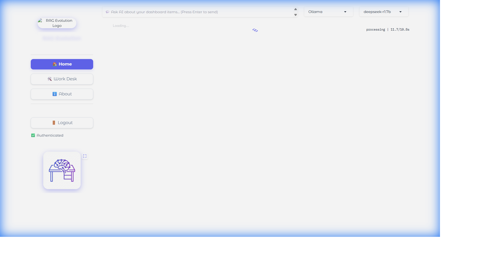
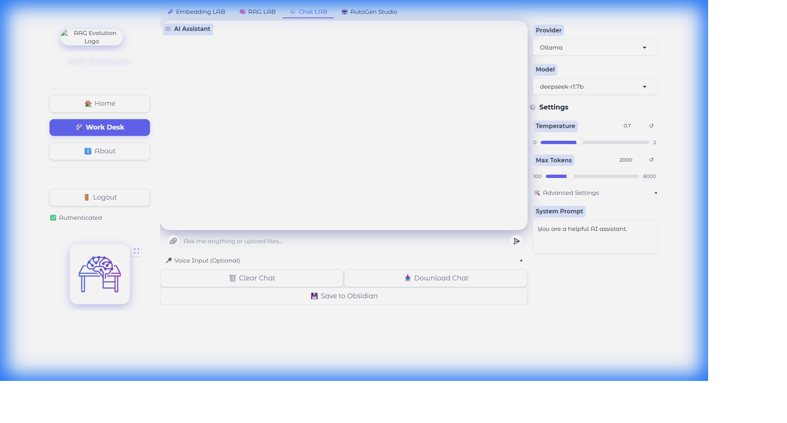
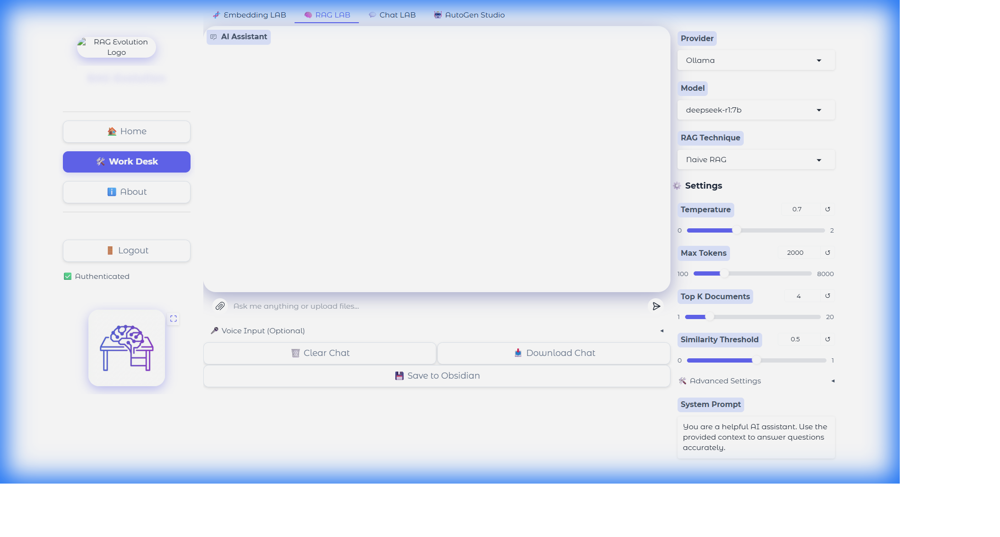
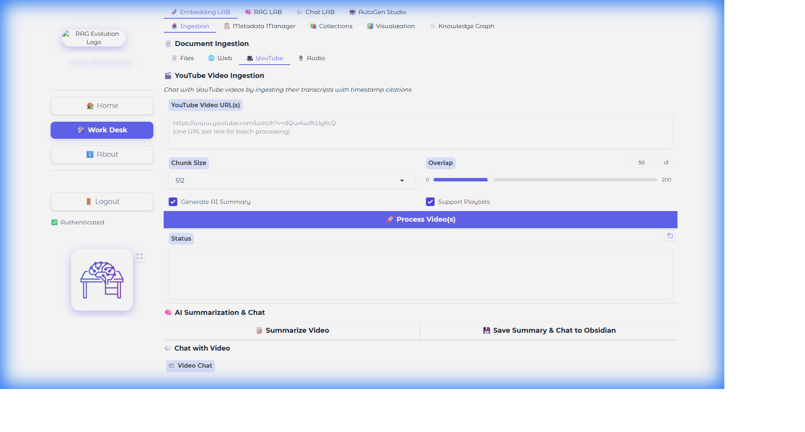
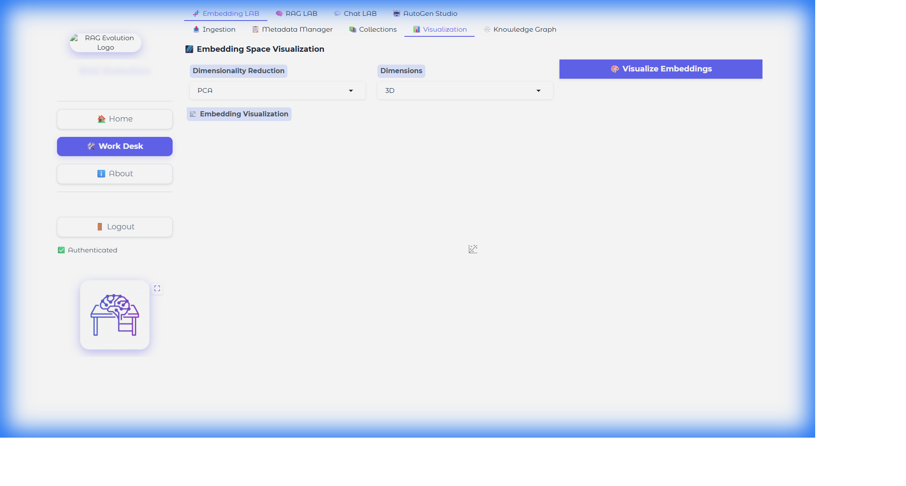

# 🚀 AI Workdesk

A professional Python workdesk for developing and utilizing various AI tools. Built with modern best practices using `uv` for ultra-fast dependency management.

## ✨ Key Features

- 🏠 **Smart Homepage**: Full-width glassmorphism dashboard with AI-powered insights
- ⚙️ **Granular Control**: Advanced settings for Top-K, Chunk Size, Overlap, and Reranking
- 🧪 **Engineering Labs**: Dedicated tabs for **Embedding** (Ingestion) and **Chat** (Retrieval)
- 🗄️ **Multi-DB Support**: Integration with ChromaDB, FAISS, PGVector, and more
- 🌐 **Flexible Providers**: Support for OpenAI, HuggingFace, Ollama, and Google Gemini embeddings
- 💬 **Context-Aware Chat**: Chat with your dashboard items using selected AI models
- 🎥 **YouTube Integration**: Ingest video transcripts with timestamp citations
- 📊 **Knowledge Graph**: Visualize entity relationships in your documents
- 🔍 **Advanced RAG**: Multiple retrieval strategies (Naive, HyDE, Fusion, Hybrid, Graph+Vector)
- 📚 **Comprehensive Documentation**: Auto-generated TOC with interactive navigation in About page

## 📸 UI Gallery

<div align="center">
  
  <p><em>Smart Dashboard with Glassmorphism Design</em></p>
</div>

<div align="center">
  
  <p><em>Chat LAB for Direct AI Interaction</em></p>
</div>

<div align="center">
  
  <p><em>RAG LAB with Advanced Retrieval Settings</em></p>
</div>

<div align="center">
  
  <p><em>YouTube Video Ingestion & Summarization</em></p>
</div>

<div align="center">
  
  <p><em>Knowledge Graph & Embedding Visualization</em></p>
</div>

## 🆕 Recent Updates (November 29, 2024)

### 🚀 Performance & Visualization
- ✅ **Graph Caching Optimization**: Intelligent caching system that avoids expensive rebuilds (90%+ faster parameter tuning)
- ✅ **Enhanced Graph Aesthetics**: 
  - Fixed edge density issues with alpha blending (opacity 0.3)
  - Thinner, smoother edges for better clarity in dense networks
  - Background color picker for custom visualization themes
- ✅ **3D Graph Improvements**: Optimized link opacity and colors for better depth perception

### 🤖 AutoGen Studio Integration
- ✅ **Seamless UI Integration**: AutoGen Studio embedded directly within the Workdesk
- ✅ **Full Screen Mode**: Dedicated "Open Full Screen" button for immersive agent workflow management
- ✅ **Multi-Agent Orchestration**: Create, manage, and run complex agent teams

### 🎥 YouTube Intelligence
- ✅ **Video Summarization**: One-click generation of concise video summaries
- ✅ **Interactive Chat**: Chat with video content using RAG
- ✅ **Metadata Tracking**: Automatic tracking of processed videos in the Metadata Manager

### 🐛 Bug Fixes & Improvements
- ✅ **UI Stability**: Fixed Gradio app corruption and restored missing methods
- ✅ **Graph Rendering**: Resolved black area issues in dense graphs
- ✅ **System Reliability**: Improved error handling for ingestion pipelines

## 🆕 Recent Updates (November 30, 2024)

### 📚 Comprehensive Documentation System
- ✅ **Auto-Generated Table of Contents**: Python-Markdown powered TOC with automatic header extraction
- ✅ **Structured Documentation**: Complete guides for Getting Started, Features, Configuration, and more
- ✅ **Interactive Navigation**: Clickable TOC sidebar with smooth scrolling to sections
- ✅ **Professional Styling**: Syntax-highlighted code blocks with copy buttons
- ✅ **Tabbed Interface**: Organized documentation in the About page with multiple tabs
- ✅ **Zero Maintenance**: TOC automatically updates when documentation changes

### 🎨 UI Enhancements
- ✅ **Collapsible Sidebar**: Toggle button (☰) to expand/collapse navigation
- ✅ **Agentic LAB**: Renamed "AutoGen Studio" to "Agentic LAB" with external link indicator (↗)
- ✅ **Persistent State**: Sidebar collapse state saved in localStorage
- ✅ **Improved Navigation**: AutoGen Studio moved to main sidebar (opens in new tab)

## 🆕 Recent Updates (November 24, 2024)

### 🐛 Bug Fixes & Improvements ✅
- ✅ **Fixed Embedding Errors**: Resolved `add_documents()` TypeError in vector store and Smart Dashboard
- ✅ **Improved Web Crawling**: Better timeout handling (120s), max pages limit (100), and error messages
- ✅ **YouTube UI Enhancement**: Added scrolling capability to status textbox for long summaries
- ✅ **Similarity Threshold**: Updated default from 0.7 to 0.1 for better retrieval recall
- ✅ **Project Cleanup**: Moved debug/test scripts to appropriate directories (`scripts/`, `tests/`)
- ✅ **Copy Buttons**: Added copy functionality to all status textboxes in Embedding LAB

### 🧬 Embedding LAB Enhancements
- ✅ **Dynamic Model Selection**: Choose embedding models before ingestion (HuggingFace, Ollama, OpenAI)
- ✅ **Web Crawling**: Ingest content directly from URLs with configurable depth (0-5 levels)
- ✅ **YouTube Ingestion**: Process video transcripts with auto-summary generation and playlist support
- ✅ **Enhanced Status Display**: Scrollable status boxes with copy buttons for long outputs
- ✅ **PDF Support**: Dual-strategy PDF loading (PyPDFLoader + UnstructuredPDFLoader with OCR)
- ✅ **Image OCR**: Support for image formats (PNG, JPG, TIFF, BMP, GIF) with OCR capabilities

### 🏠 Smart Homepage
- ✅ **Full-Width Glassmorphism UI**: Modern, asymmetrical 65/35 split layout
- ✅ **Time & Weather Widget**: Live clock and weather display at top right
- ✅ **Smart Feed**: Timeline-style feed combining emails, news, videos, and trends
- ✅ **Clickable Items**: All dashboard items link to their original sources
- ✅ **Context-Aware AI Chat**: Chat with dashboard items using Ollama or OpenAI
- ✅ **File Attachments**: Upload text files (.txt, .md, .py, etc.) for AI analysis
- ✅ **Inline Citations**: AI answers include "Sources Used" with links and urgency scores

### 📊 Advanced Features
- ✅ **Knowledge Graph**: Entity extraction and relationship visualization
- ✅ **Embedding Projector**: UMAP/t-SNE visualization in 2D/3D
- ✅ **Metadata Tracking**: SQLite-based document metadata with pagination
- ✅ **Collection Management**: Create, switch, and delete vector store collections
- ✅ **RAG Evaluation**: Quality metrics and performance tracking

## 📁 Project Structure

```
ai-workdesk/
├── src/
│   └── ai_workdesk/           # Main package
│       ├── core/              # Core utilities
│       │   ├── auth.py       # Authentication manager
│       │   ├── config.py     # Configuration management
│       │   └── logger.py     # Logging setup
│       ├── rag/              # RAG pipeline
│       │   ├── ingestion.py  # Document processing & chunking
│       │   ├── vector_store.py # Vector database management
│       │   ├── metadata_store.py # Document metadata tracking
│       │   ├── graph_rag.py  # Knowledge graph RAG
│       │   ├── youtube_loader.py # YouTube transcript loader
│       │   └── advanced_features.py # OCR, evaluation, multimodal
│       ├── smart_dashboard/  # Smart Homepage
│       │   ├── ui.py         # Dashboard UI components
│       │   ├── data_engine.py # Data aggregation
│       │   ├── ai_processor.py # AI chat integration
│       │   ├── rag_engine.py # Dashboard RAG engine
│       │   ├── models.py     # Data models
│       │   └── fetchers/     # Data source fetchers
│       │       ├── email_fetcher.py
│       │       ├── rss_fetcher.py
│       │       ├── youtube_fetcher.py
│       │       └── trends_fetcher.py
│       ├── ui/               # User interfaces
│       │   ├── gradio_app.py # Gradio web interface
│       │   └── assets/       # UI assets (logo, etc.)
│       ├── tools/            # AI tools collection
│       │   ├── llm/         # LLM tools
│       │   │   └── ollama_client.py # Ollama local model wrapper
│       │   ├── embeddings/  # Embedding tools
│       │   ├── retrieval/   # RAG tools
│       │   └── vision/      # Vision tools
│       └── utils/           # Shared utilities
├── scripts/                 # Utility scripts
│   ├── debug_ocr.py        # OCR debugging
│   ├── verify_pdf_fix.py   # PDF verification
│   └── ...                 # Other utility scripts
├── tests/                   # Test suite
│   ├── test_rag_chat.py    # RAG chat tests
│   └── ...                 # Other tests
├── docs/                    # Documentation
├── data/                    # Data directory
│   └── chroma_db/          # ChromaDB persistent storage
└── config/                  # Configuration files
```

## 🚀 Quick Start

### Prerequisites

- Python 3.12+
- `uv` installed ([Install Guide](https://docs.astral.sh/uv/getting-started/installation/))
- **Recommended**: [Ollama](https://ollama.ai/) for local model support (privacy and offline use)
- **Optional**: Tesseract OCR for scanned PDF/image processing

### Installation

1. **Clone or navigate to the project directory:**
```bash
cd "C:\\RAG LAB"
```

2. **Sync dependencies:**
```bash
uv sync
```

3. **Set up environment variables:**
```bash
# Copy the example file
cp .env.example .env

# Edit .env and add your API keys (optional for Ollama-only usage)
```

4. **Run the Web UI:**
```bash
uv run ai-workdesk-ui
```

**Default Login Credentials:**
- Username: `admin`
- Password: `admin123`

5. **Install Ollama for Local Models (Recommended):**
```bash
# Download and install Ollama from https://ollama.ai/

# Pull recommended models
ollama pull deepseek-r1:7b      # Chat model (reasoning) - Default
ollama pull nomic-embed-text    # Embedding model
```

6. **Optional: Install Tesseract OCR (for scanned PDFs/images):**
```bash
# Windows: Download from https://github.com/UB-Mannheim/tesseract/wiki
# macOS: brew install tesseract
# Linux: sudo apt-get install tesseract-ocr
```

## 🏠 Smart Homepage

The Smart Homepage is your AI-powered command center, providing an intelligent overview of your digital workspace.

### Features

**🎨 Full-Width Glassmorphism Design**
- Modern asymmetrical layout (65/35 split)
- Borderless glass components with high blur effects
- Editorial-style typography using Outfit font
- Smooth animations and hover effects

**⏰ Time & Weather Widget**
- Live clock display
- Current date
- Weather icon (customizable with real API integration)
- Located at top right for quick reference

**📊 Smart Feed**
- Timeline-style feed combining multiple sources:
  - 📧 Email updates
  - 📰 RSS news feeds
  - 📺 YouTube videos
  - 📈 Trending topics
- All items are **clickable** and link to their original sources
- Sorted by urgency score and timestamp

**💬 Context-Aware AI Chat**
- Chat bar positioned at the top for easy access
- **Default Model**: DeepSeek-R1:7b (Ollama)
- **Provider Selection**: Switch between Ollama and OpenAI
- **Full Context**: AI receives complete details of all dashboard items
- Ask questions like:
  - "Summarize the urgent items"
  - "What are the trending topics today?"
  - "Show me YouTube videos about AI"

## 📄 Document Ingestion & RAG Pipeline

The AI Workdesk includes a complete RAG (Retrieval-Augmented Generation) pipeline with document ingestion and vector storage capabilities.

### 🧬 Embedding LAB (Document Ingestion)

Upload and process documents to build your knowledge base:

#### Ingestion Methods

**📄 Files Tab**
1. Select embedding provider (HuggingFace, Ollama, OpenAI)
2. Choose embedding model
3. Upload files (see supported formats below)
4. Configure chunking settings
5. Click "🚀 Ingest Documents"

**🌐 Web Tab**
1. Enter target URL
2. Set crawl depth:
   - **0**: Single page only
   - **1**: Page + direct links
   - **2+**: Deeper crawling (use with caution)
3. Configure timeout (default: 120s) and max pages (default: 100)
4. Click "🚀 Crawl & Ingest"

**🎥 YouTube Tab**
1. Enter YouTube URL(s) (one per line for batch processing)
2. Enable/disable auto-summary generation
3. Enable/disable playlist support
4. Configure chunking settings
5. Click "🚀 Process Videos"

**Features:**
- ✅ Scrollable status output for long summaries
- ✅ Copy button to save status/summaries
- ✅ Timestamp preservation for video citations
- ✅ Automatic metadata tracking

### 💬 Chat LAB (RAG-Enhanced Chat)

Interact with your documents using advanced RAG techniques:

**RAG Techniques:**
- **Naive RAG**: Direct similarity search (fastest)
- **HyDE**: Hypothetical Document Embeddings for better semantic matching
- **RAG Fusion**: Multiple query variations with merged results
- **Hybrid Search**: Combines semantic and keyword search
- **Graph+Vector**: Entity-aware retrieval using knowledge graph
- **None**: Chat without document retrieval

**Advanced Settings:**
- **Top-K Retrieval**: 1-20 chunks (default: 5)
- **Similarity Threshold**: 0.0-1.0 (default: 0.1)
  - Lower values = more permissive retrieval
  - Recommended: 0.1-0.3 for ChromaDB
- **Chunk Size**: 256, 512, 1024, 2048 tokens
- **Chunk Overlap**: 0-200 tokens
- **Reranker**: Enable/disable result reranking
- **System Prompt**: Custom AI instructions

**Chat Features:**
- ✅ Source citations with document references
- ✅ Export chat as Markdown
- ✅ Temperature control (0.0-2.0)
- ✅ Max tokens up to 8192
- ✅ Provider switching (OpenAI/Ollama)

### 📊 Visualization & Analysis

**Embedding Projector**
- Visualize document embeddings in 2D/3D
- Methods: UMAP, t-SNE
- Quality metrics: silhouette score, Davies-Bouldin index

**Knowledge Graph**
- Entity extraction (People, Organizations, Locations, Products, Events)
- Interactive network visualization with vis.js
- **Dynamic Filtering**: Adjust max nodes and connection strength in real-time
- **Premium Aesthetics**: Bright, vibrant node colors with subtle edge rendering
- **Optimized Performance**: Reduced logging (every 100 documents) for faster processing
- Graph statistics and metrics

**Metadata Management**
- View all ingested documents
- Pagination support
- Document summaries
- Delete individual entries

### Supported File Formats

**Documents:**
- Text Files (`.txt`)
- PDF Files (`.pdf`) - with OCR support for scanned documents
- Markdown (`.md`)
- Word Documents (`.docx`)
- PowerPoint (`.pptx`)
- Excel Files (`.xlsx`, `.xls`)

**Data:**
- CSV Files (`.csv`)
- JSON Files (`.json`)

**Web:**
- HTML Files (`.html`, `.htm`)

**Images (with OCR):**
- PNG (`.png`)
- JPEG (`.jpg`, `.jpeg`)
- TIFF (`.tiff`, `.tif`)
- BMP (`.bmp`)
- GIF (`.gif`)

**Media:**
- YouTube Videos (via URL)

### Vector Store

- **Default**: ChromaDB (persistent storage)
- **Location**: `./data/chroma_db/` directory
- **Embedding Models**: 
  - **Ollama**: `nomic-embed-text` (default, local)
  - **HuggingFace**: `sentence-transformers/all-MiniLM-L6-v2`
  - **OpenAI**: `text-embedding-3-small`
- **Features**: Automatic persistence, metadata support, similarity search, hybrid search

## 🔐 Authentication Setup

### Option 1: Environment Variables (Recommended)

Create a `.env` file in the project root:

```bash
# LLM API Keys (Optional - for cloud models)
OPENAI_API_KEY=your-openai-api-key-here
ANTHROPIC_API_KEY=your-anthropic-api-key-here

# Model Configuration
DEFAULT_LLM_MODEL=gpt-4o-mini
DEFAULT_TEMPERATURE=0.7

# Ollama Configuration (for local models)
OLLAMA_BASE_URL=http://localhost:11434
OLLAMA_CHAT_MODEL=deepseek-r1:7b
OLLAMA_EMBEDDING_MODEL=nomic-embed-text
```

### Option 2: Ollama Local Models (Privacy-First)

For complete privacy and offline usage, use Ollama without any API keys:

1. **Install Ollama**: Download from [ollama.ai](https://ollama.ai/)
2. **Pull Models**:
   ```bash
   ollama pull deepseek-r1:7b     # Reasoning chat model
   ollama pull nomic-embed-text   # Embedding model
   ```
3. **Configure `.env`**:
   ```bash
   OLLAMA_BASE_URL=http://localhost:11434
   OLLAMA_CHAT_MODEL=deepseek-r1:7b
   OLLAMA_EMBEDDING_MODEL=nomic-embed-text
   ```

The system will automatically use Ollama models when configured, with no cloud API keys required.

## 📚 Usage Examples

### Using the Smart Homepage Chat

```python
# The Smart Homepage automatically provides context to the AI
# Just type your question in the chat bar at the top:

# Example queries:
"What are my most urgent items?"
"Summarize the trending topics"
"Show me all YouTube videos from today"
"What emails need immediate attention?"
```

### Using Ollama Client (Local, Privacy-First)

```python
from ai_workdesk.tools.llm.ollama_client import OllamaClient

# Initialize with default model from .env (deepseek-r1:7b)
client = OllamaClient()

# Chat with the model
response = client.chat("Explain quantum computing in simple terms")
print(response)

# Use a different model dynamically
response = client.chat("Hello!", model="llama3")
print(response)

# List available models
models = client.list_models()
print(f"Available models: {models}")
```

### Using the RAG Pipeline

```python
from ai_workdesk.rag.ingestion import DocumentProcessor
from ai_workdesk.rag.vector_store import VectorStoreManager

# Initialize components
doc_processor = DocumentProcessor()
vector_store = VectorStoreManager()

# Load and process documents
documents = doc_processor.load_documents(["path/to/file.pdf"])
chunks = doc_processor.chunk_documents(documents, chunk_size=512, chunk_overlap=50)

# Add to vector store
vector_store.add_documents(chunks)

# Search
results = vector_store.similarity_search("your query", k=5, score_threshold=0.1)
```

## 🔧 Configuration

All configuration is managed through environment variables and `pyproject.toml`:

### Environment Variables

See `.env.example` for all available options:

**LLM & Model Settings:**
- Cloud API Keys: OpenAI, Anthropic, Google, Cohere (optional)
- Ollama Settings: Base URL, chat model, embedding model
- Model Defaults: Default models, temperature, max tokens

**Application Settings:**
- Environment, log level, paths
- Vector Store: ChromaDB configuration
- Security: Rate limiting, timeouts, retries
- Advanced RAG: Top-K retrieval, chunk size/overlap, reranking

## 🐛 Troubleshooting

### Web Crawling Timeouts

If you encounter `TimeoutError` when crawling websites:
1. **Reduce crawl depth** to 0 or 1
2. **Increase timeout** in the code (default: 120s)
3. **Use max_pages limit** to prevent overwhelming sites
4. **Try single pages** instead of deep crawling

### PDF Loading Errors

If PDFs fail to load:
1. **Install Tesseract OCR** for scanned documents
2. **Check PDF format** - some encrypted PDFs may not work
3. **Try PyPDFLoader fallback** - automatically attempted

### Embedding Errors

If you see `add_documents()` errors:
- ✅ **Fixed in latest version** - update your code
- Ensure you're passing Document objects, not raw text

## 💻 Development

### Running Tests

```bash
# Run all tests
uv run pytest

# Run with coverage
uv run pytest --cov=ai_workdesk --cov-report=html

# Run specific test file
uv run pytest tests/test_rag_chat.py
```

### Code Quality

```bash
# Format code with ruff
uv run ruff format .

# Lint code
uv run ruff check .

# Type checking with mypy
uv run mypy src/
```

### Utility Scripts

Located in `scripts/` directory:

#### Debugging & Testing
- **`debug_ocr.py`** - Test OCR functionality with sample images
- **`debug_graph.html`** - Static HTML output for graph visualization debugging
- **`debug_graph_html.py`** - Generate debug HTML for knowledge graph testing
- **`test_graph.html`** - Test HTML file for graph rendering
- **`reproduce_issue.py`** - Reproduce and debug specific issues
- **`reproduce_issue_v2.py`** - Enhanced issue reproduction script

#### Data Inspection
- **`check_db.py`** - Check vector database status and contents
- **`check_count.py`** - Count documents and chunks in the database
- **`inspect_data.py`** - Inspect vector store data and metadata
- **`check_sources.txt`** - Output file with source document information
- **`check_output.txt`** - General output file for inspection scripts
- **`inspect_output.txt`** - Detailed inspection results
- **`output.txt`** - General script output file

#### Verification
- **`verify_pdf_fix.py`** - Verify PDF loading functionality
- **`verify_metadata.py`** - Verify metadata store integrity

#### Sample Data
- **`ingest_sample.py`** - Sample script for document ingestion testing

**Usage Example**:
```bash
# Check database status
uv run python scripts/check_db.py

# Debug OCR
uv run python scripts/debug_ocr.py

# Verify PDF loading
uv run python scripts/verify_pdf_fix.py
```

## 📦 Installing Optional Dependencies

The project uses optional dependency groups for different AI tools:

```bash
# Install LLM tools (OpenAI, Anthropic, LangChain, etc.)
uv sync --extra llm

# Install embedding tools
uv sync --extra embeddings

# Install vision tools
uv sync --extra vision

# Install everything
uv sync --extra all

# Install dev dependencies (already installed by default)
uv sync --extra dev
```

## 📖 Available Dependency Groups

| Group | Description | Install Command |
|-------|-------------|-----------------|
| `core` | Base dependencies (always installed) | `uv sync` |
| `llm` | LLM tools (OpenAI, Anthropic, LangChain) | `uv sync --extra llm` |
| `embeddings` | Embedding & vector stores | `uv sync --extra embeddings` |
| `vision` | Computer vision tools | `uv sync --extra vision` |
| `all` | All AI tools | `uv sync --extra all` |
| `dev` | Development tools | Installed by default |

## 🤝 Contributing

1. Create a feature branch
2. Make your changes
3. Run tests and linting: `uv run pytest && uv run ruff check .`
4. Submit a pull request

## 📝 License

This project is licensed under the MIT License.

## 🙏 Acknowledgments

- Built with [uv](https://github.com/astral-sh/uv) - An extremely fast Python package installer
- Local model support powered by [Ollama](https://ollama.ai/) - Run LLMs locally
- RAG pipeline built with [LangChain](https://www.langchain.com/) - Framework for LLM applications
- Vector store powered by [ChromaDB](https://www.trychroma.com/) - AI-native open-source embedding database
- Uses [Pydantic](https://docs.pydantic.dev/) for settings management
- Logging powered by [Loguru](https://github.com/Delgan/loguru)
- Beautiful terminal output with [Rich](https://github.com/Textualize/rich)
- Web UI built with [Gradio](https://www.gradio.app/) - Fast web interfaces for ML
- Knowledge graphs with [NetworkX](https://networkx.org/) and [PyVis](https://pyvis.readthedocs.io/)
- OCR powered by [Tesseract](https://github.com/tesseract-ocr/tesseract) and [Unstructured](https://unstructured.io/)

---

**Happy Building! 🚀**

For questions or issues, please open an issue on the repository.
